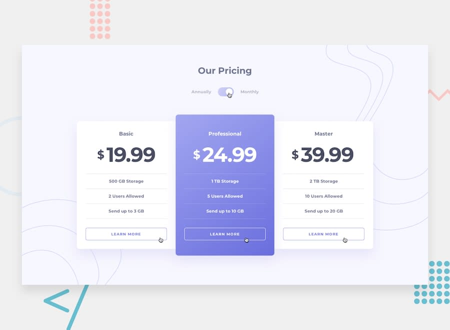

# Frontend Mentor - Pricing component with toggle

This is a solution to the [Pricing component with toggle](https://www.frontendmentor.io/challenges/pricing-component-with-toggle-8vPwRMIC) challenge on Frontend Mentor.

## Table of contents

- [Overview](#overview)
  - [The challenge](#the-challenge)
  - [Screenshot](#screenshot)
  - [Links](#links)
- [My process](#my-process)
  - [Built with](#built-with)
- [Author](#author)

## Overview

### The challenge

Your users should be able to:

- View the optimal layout for the component depending on their device's screen size
- Control the toggle with both their mouse/trackpad and their keyboard
- ~~**Bonus**: Complete the challenge with just HTML and CSS~~

### Screenshot

### Links

- Solution URL: [Link](https://www.frontendmentor.io/solutions/pricing-component-with-toggle-kmfkdO2rm)
- Live Site URL: [Link](https://pricing-component-with-toggle.sz7kow.com/)

## My process

### Built with

- HTML
- JavaScript
- Sass

## Author
- Frontend Mentor - [@sz7kow](https://www.frontendmentor.io/profile/sz7kow)
